# WinCC OA Alarm messages to Team
For the setup of the WinCC OA messenger, you will need three prerequisits:
* setup your MS Teams Team and add a incoming WebHook 
* WinCC OA V3.20
* nodejs V18++ 
## Add an incoming webHook to your Team
Select "..." at your Team
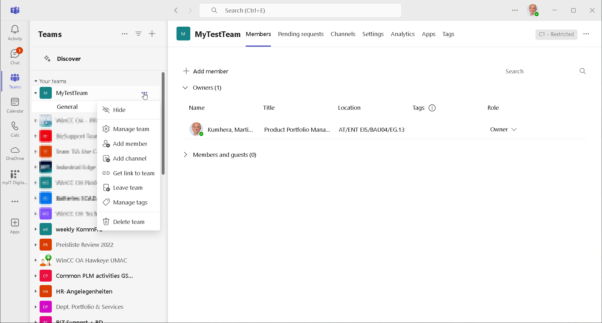
Select "Team verwalten"
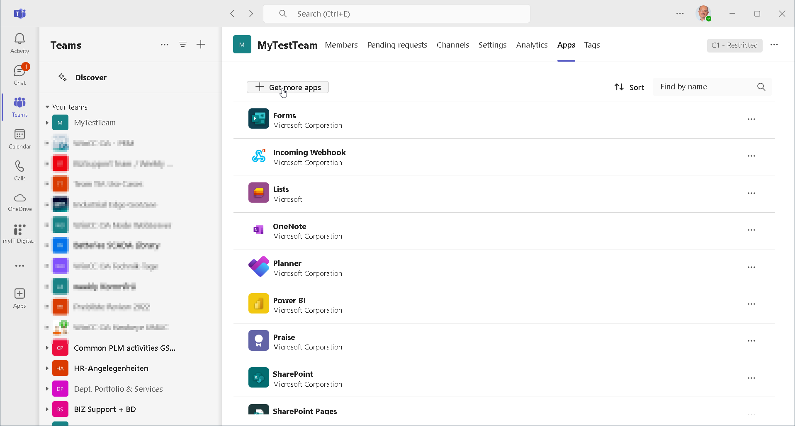
Select "Add App"
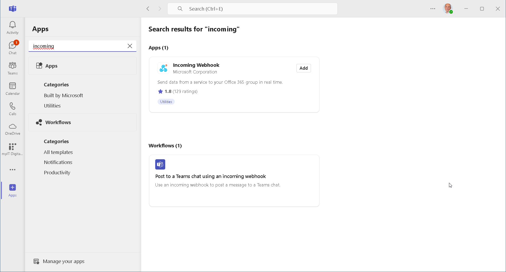
Add "Incoming WebHook" App
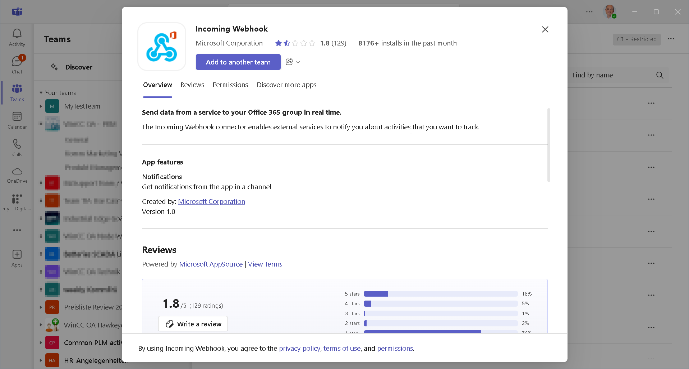
Choose "Add to a Team"
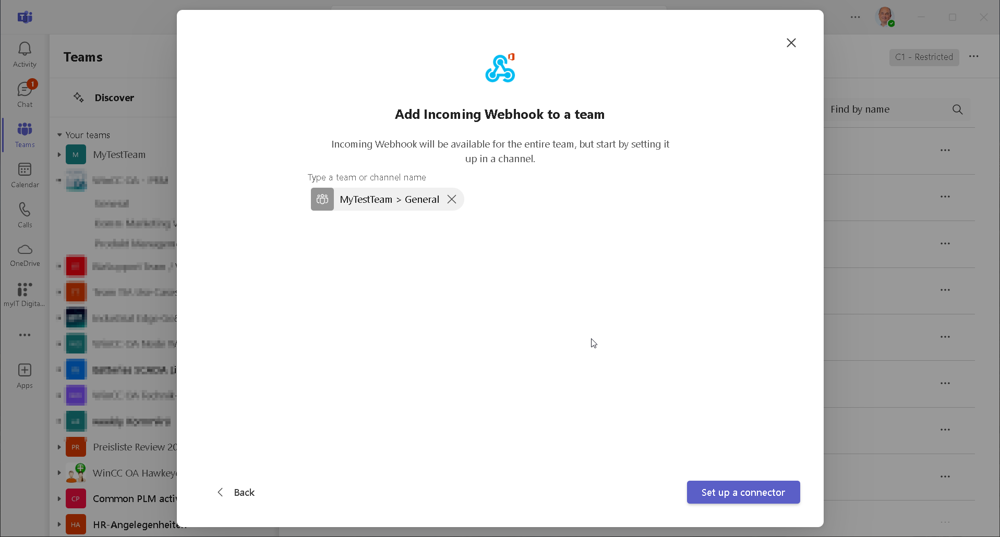
Select "Connection einrichten"
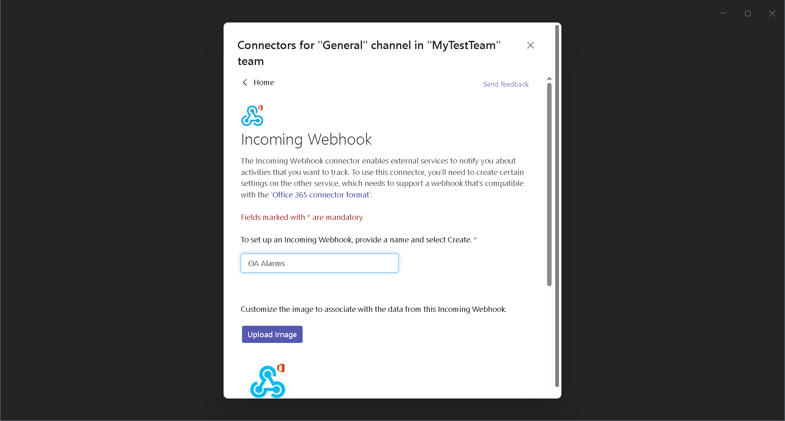
Choose a name which will be used to identify all messages communicated via this hook and select "Einrichten"
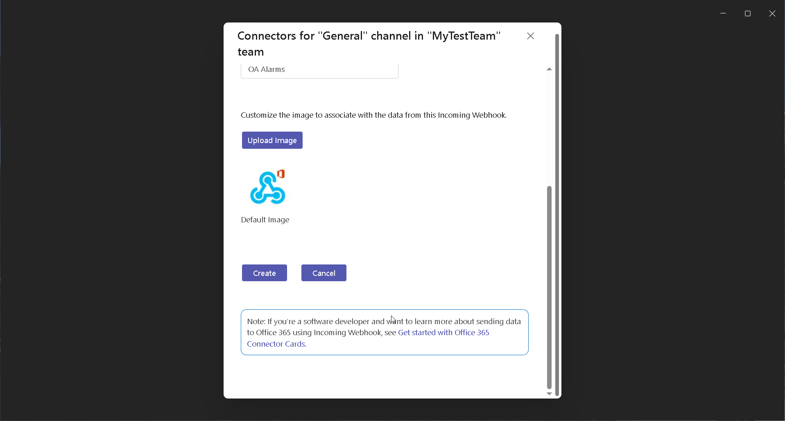
Teams will generate a unique URL for your WebHook.
Copy the Link and add it in the source file for your url variable.
Then finish the configuration
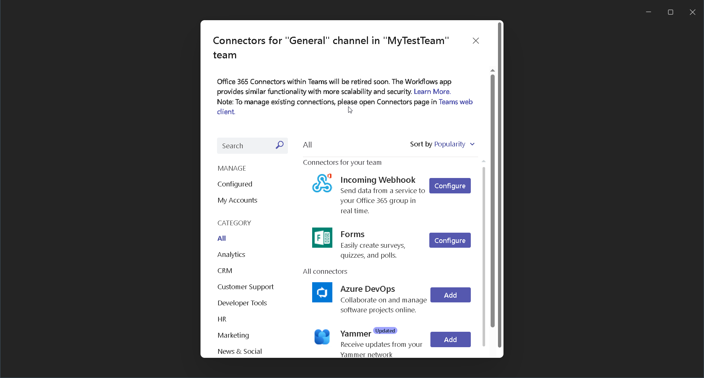
## Setup your NodeJS Project
Copy this project in a directory of your choice - ideally in your WinCC OA Project/data/node
Add the created WebHook URL in the code of index.js (url=...)

Check / change the path to your WinCC OA Product installtion in the package.json file

Execute "npm install" in your project directory to get all required packages

## Configure your WinCC OA Project
Start the WinCC OA console 
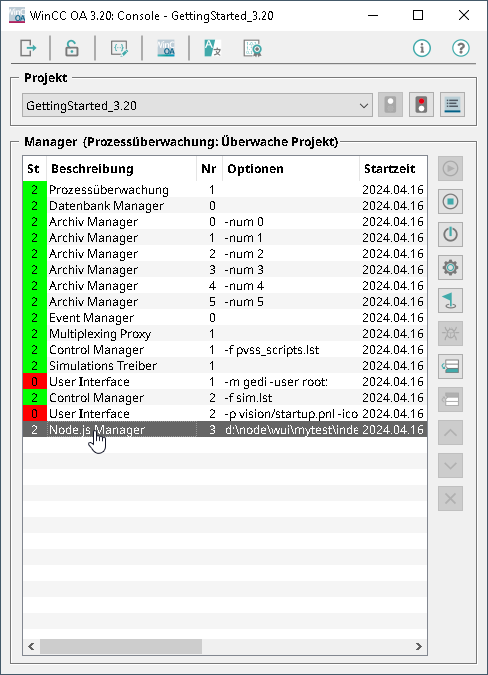

Add a new "node" manager in your project console and provide the path (ideally full path) to the index.js file in this NodeJS project.
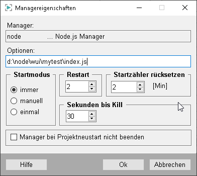

## Finaly
Start your project and you should see, that the node manager is correctly starting and running.
And you should receive a new message in your MS Teams Team.
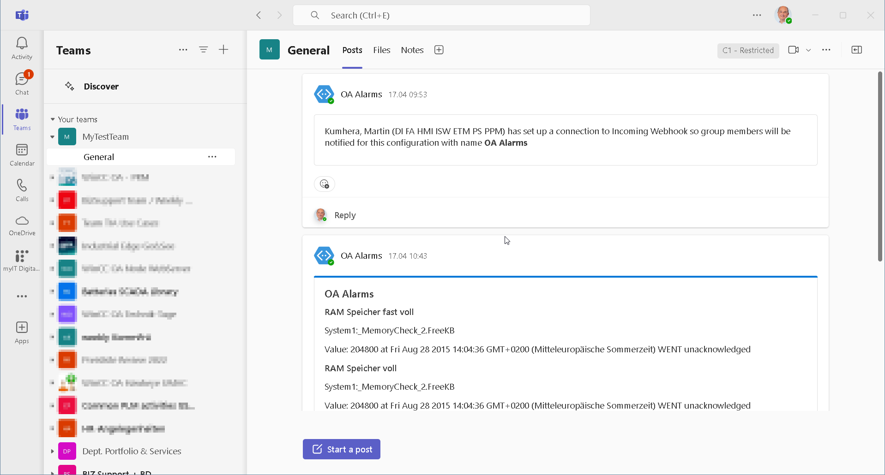

## Additional
Now you can start to modify your application.
At first you might change the select statement in the dpQueryConnectSingle call to change the set of alarms you want to receive and/or the information you want to receive.